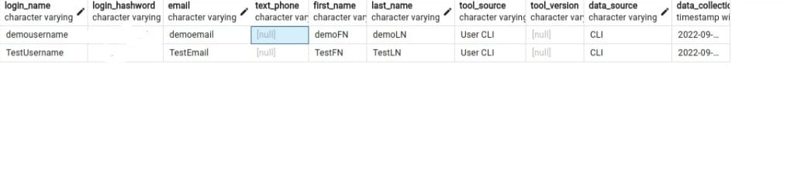
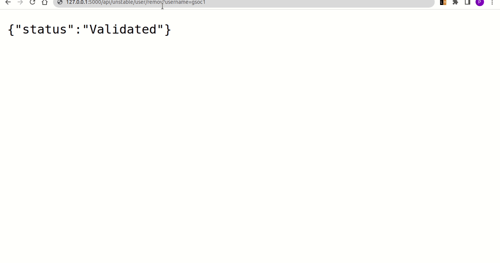

<h1 align="center"><a href="https://summerofcode.withgoogle.com/programs/2022/projects/YNXT2TFX">Build Access and Entitlements for Hosted version of Augur</a></h1>
<figure>
  
</figure>

Check out my <a href="">blog</a> or follow me on <a href="https://twitter.com/shivikapriya">Twitter</a> for more updates.

  <a href="project/Priya_Srivastava_GSoCproposal_CHAOSS.pdf"> Proposal </a>|
  <a href="project-details"> Project Details</a> |
  <a href="activity-reports/"> Blogs</a> |
  <a href="#additional-info"> Links</a>

## CONTENTS
* [Project Details](#project-details-)
* [Objectives](#objectives-)
* [Objectives Accomplished](#objectives-accomplished-)
* [Work](#work-)
* [Activity Reports](#activity-reports-)
* [Mentors](#mentors-)
* [Acknowledgement](#acknowledgements-)
* [Additional Info](#additional-info-)
* [Student Developer Info](#student-developer-info-)
  
## PROJECT DETAILS[&uarr;](#contents-)
### [Augur](https://github.com/chaoss/augur):
Augur is a software suite for collecting and measuring structured data about free and open-source software (FOSS) communities. We do this by gathering data about project repositories and normalizing that into our data model to provide useful metrics about your project’s health. 
[augur-new](https://github.com/chaoss/augur/tree/augur-new)

## OBJECTIVES [&uarr;](#project-details-)
### Primary
| \# | Status  | Objectives                    
| --- | --- | ----------------------------- | 
| 1 | :heavy_check_mark: | Develop login functionalities so that admins and users can access augur. Populate the tables with information from the user. |
| 2 | :heavy_check_mark: | Connect the login to the augur_data.chaoss_user table instead of the sqllite3 database. |
| 3 | :heavy_check_mark: | Implement the endpoints necessary for account creation and authentication on the backend. |
| 4 | :heavy_check_mark: | Work on the CLI components for creating admin and user accounts. |

### Secondary
- :heavy_check_mark: Augur enpoints to be deployed from augur-new. Install augur-new and test the schema creation with SQLAlchemy, and see if it at least creates a schema with all the data integrity protections we engineered into it.

## OBJECTIVES ACCOMPLISHED [&uarr;](#objectives-)

### `augur user add` subcommand to add users:

``augur user add <username> <email> <firstname> <lastname>``  
``augur user add <username> <email> <firstname> <lastname>  --admin ``

The `augur user add` CLI group is for adding user to Augur's database. All commands are invoked like:
  $ augur user add <command attributes>

<h3>Resulting Database:<h3>

### Installing augur-new:

### API Endpoints:

 <b> Create User </b> 

Command invoked like: 
``http://127.0.0.1:5000/api/unstable/user/create?username=<username>&password=<password>&email=<email>&first_name=<first_name>&last_name=<last_name>`` 

 <b> Validate User </b> 

Command invoked like: 

``http://127.0.0.1:5000/api/unstable/user/create?username=<username>&password=<password>``

 <b> Update User </b> 

For example to update username command invoked like: 

``http://127.0.0.1:5000/api/unstable/user/create?username=<username>&password=<password>&new_username=<new_username>``

<b> Remove User</b> 

Command invoked like:

``http://127.0.0.1:5000/api/unstable/user/remove?username=<username>``

## WORK [&uarr;](#objectives-accomplished-)
### What Was Done
During these three months I have completed all the essential objectives which includes

| \# | Objectives | PR/Commit/Link | Associated Deliverables | Status |
|----|-------------|----------------|---------|--------|
| 1 | Installation of augur_view | [PR Link](https://github.com/augurlabs/augur_view/pull/22) |  | Completed |
| 2 | Add user subcommand with username functionality | [Link](https://github.com/chaoss/augur/pull/1912/commits/8ad805770a2a87790b2aab7340021df2b4a71bff) |  | Completed |
| 3 | Add user with email | [Link](https://github.com/chaoss/augur/pull/1912/commits/2f21f567305bdf56dd6f8524ab587114139a5756) | Add user with unique email and username command | Completed |
| 4 | Add Password hashing for the user| [Link](https://github.com/chaoss/augur/pull/1912/commits/1e57f9a073ebcf651eb6b92fe0353d6053bf185f) | Password hashing added | Completed |
| 5 | augur user add <username> <email> subcommand | [PR Link](https://github.com/chaoss/augur/pull/1912) | CLI components for creating admin and user accounts. add_user method takes username as argument as adds it to the table user. | Completed |
| 6 | Added Create user endpoint | [Link](https://github.com/chaoss/augur/pull/1953/commits/c5a7d1d74a5a2e1c4ac52bd27de9d401f98eead5) | API endpoint for creating user as per user schema (does not use ORM) | Completed |
| 7 | Added Validate user endpoint  | [Link](https://github.com/chaoss/augur/pull/1953/commits/64741898326de4ce215fb18f4f5652a9e149d7a8) | API endpoint for validating user email, username and password(does not use ORM) | Completed |
| 8 | Added remove user endpoint  | [Link](https://github.com/chaoss/augur/pull/1953/commits/23a0cf3540fc93c1105956b4b00839b886e1aa48) | API endpoint for deleting user from database(does not use ORM) | Completed |
| 9 | Added update user endpoint  | [Link](https://github.com/chaoss/augur/pull/1953/commits/a9634068e5e2b0f9d62a15ebc68c699474050f3f) | API endpoint for updating user details like email, username and password.(does not use ORM) | Completed |
| 10 | User create endpoint ORM | [Link](https://github.com/chaoss/augur/pull/1953/commits/a4c049334efe86d678e99ffe09b947e43b9e07bb) | API endpoint for creating user using ORM | Completed |
| 11 | User validate endpoint ORM  | [Link](https://github.com/chaoss/augur/pull/1953/commits/ea5e72ff52b757ca836aa4a1a0b80b2c5d110252) | API endpoint for validating user using ORM | Completed |
| 12 | User remove endpoint ORM   | [Link](https://github.com/chaoss/augur/pull/1953/commits/557d966510924215ca43ff3d03873b580bcc3cc5) | API endpoint for remove user using ORM | Completed |
| 13 | User update endpoint ORM   | [Link](https://github.com/chaoss/augur/pull/1953/commits/2cf9afe432cc853e79f1ca68c9ba69e7d48ebbae) | API endpoint for updating user using ORM | Completed |
| 14 | Augur user API  | [PR Link](https://github.com/chaoss/augur/pull/1953/) |  | Completed |
| 14 | Augur user CLI as per new schema  | [PR Link](https://github.com/chaoss/augur/pull/1953/) |  | Completed |

## ACTIVITY REPORTS [&uarr;](#work-)
- Community Bonding Phase (May 17, 2021 - June 6, 2021) - [Report](blogs/community-bonding.md)
- Coding Period
  - Week 1 (June 7, 2021 - June 13, 2021) - [Blog](blogs/week-01-coding-period.md)
  - Week 2 (June 14, 2021 - June 20, 2021) - [Blog](blogs/week-02-coding-period.md)
  - Week 3 (June 21, 2021 - June 27, 2021) - [Blog](blogs/week-03-coding-period.md)
  - Week 4 (June 28, 2021 - July 4, 2021) - [Blog](blogs/week-04-coding-period.md)
  - Week 5 (July 5, 2021 - July 11, 2021) - [Blog](blogs/week-05-coding-period.md)
  - Week 6 (July 12, 2021 - July 18, 2021) - [Blog](blogs/week-06-coding-period.md)
  - Week 7 (July 19, 2021 - July 25, 2021) - [Blog](blogs/week-07-coding-period.md)
  - Week 8 (July 26, 2021 - August 1, 2021) - [Blog](blogs/week-08-coding-period.md)    
  - Week 9 (August 2, 2021 - August 8, 2021) - [Blog](blogs/week-09-coding-period.md)    
  - Week 10 (August 9, 2021 - August 15, 2021) - [Blog](blogs/week-10-coding-period.md)    
- [Final Report](https://gist.github.com/yash2002109/887c3e68ff3ff222f941402ceb7bf0dc)
 
## Mentors [&uarr;](#activity-reports-)
- [Sean Goggins]()
- [John Kieran]()
- [Andrew Brain]()

## Acknowledgment [&uarr;](#mentors-)
I would like to thank my mentors Sean Goggins, John Kieran & Andrew Brain for helping and guiding me throughout the GSoC Journey :)
Thanks to other mentees and mentors for collaboration.
I am thankful to Google Summer Of Code for providing me with an opportunity to work with CHAOSS.

## Additional Info [&uarr;](#acknowledgements-)
<b>This repository will be regularly updated with blogs and meetings summaries during the project.</b>
    
- [GSoC'22 Project Proposal](project/Priya_Srivastava_GSoCproposal_CHAOSS.pdf)
- [Microtasks](https://github.com/Priya730/chaoss-micro-task)
- [Project Link](https://summerofcode.withgoogle.com/programs/2022/projects/YNXT2TFX)

## Student Developer Info: [&uarr;](#additional-info-)
  * Linkedin: [Priya Srivastava](https://www.linkedin.com/in/priyasrivastava730/)
  * Github: [@Priya730](https://github.com/Priya730)
  * Twitter: [@shivikapriya](https://twitter.com/shivikapriya)
  * Blog: [@shivikapriya](https://medium.com/shivikapriya)
  * Mail: [shivikapriya730@gmail.com](mailto://shivikapriya730@gmail.com)